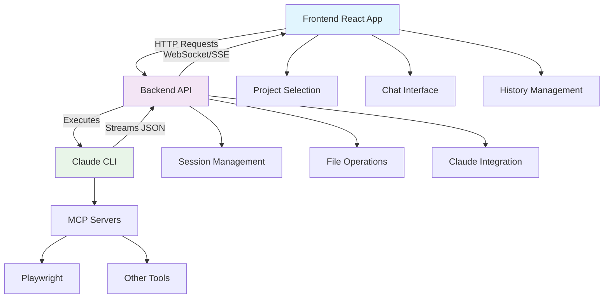

# System Architecture Diagram

```mermaid
graph TD
    A[Frontend React App] -->|HTTP Requests| B[Backend API]
    B -->|Executes| C[Claude CLI]
    C -->|Streams JSON| B
    B -->|WebSocket/SSE| A

    A --> D[Project Selection]
    A --> E[Chat Interface]
    A --> F[History Management]

    B --> G[Session Management]
    B --> H[File Operations]
    B --> I[Claude Integration]

    C --> J[MCP Servers]
    J --> K[Playwright]
    J --> L[Other Tools]

    style A fill:#e1f5fe
    style B fill:#f3e5f5
    style C fill:#e8f5e8
```
